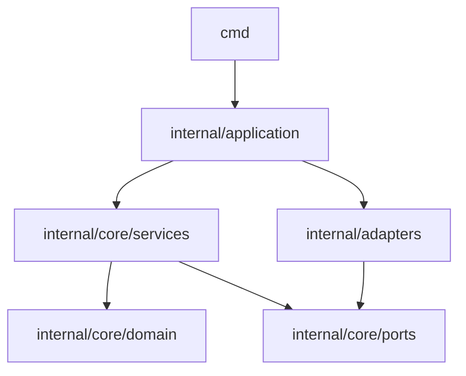
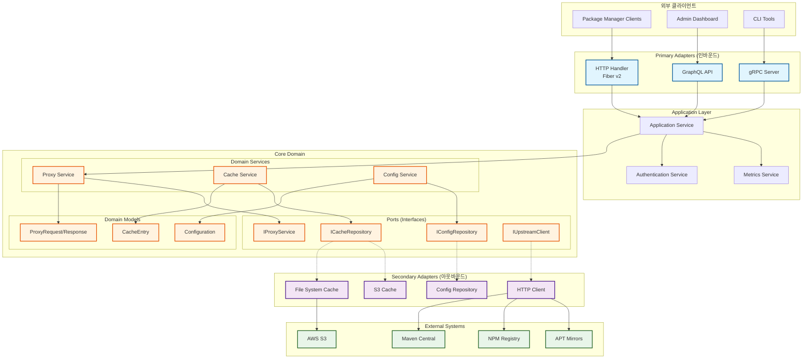
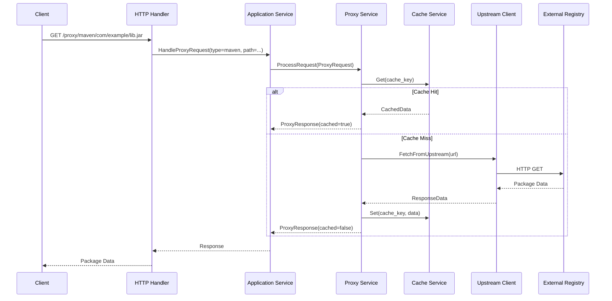

# 🔄 ProxyND 전면 리팩토링 계획

> 이 문서는 ProxyND 프로젝트의 누적된 기술 부채를 해결하고 지속 가능한 아키텍처로 전환하기 위한 종합적인 리팩토링 계획입니다.

## 📊 현재 상태 분석

### 1. 기술 부채 현황

#### 1.1 임시 파일 및 스크립트
- **문제**: 루트 디렉토리에 30개 이상의 임시 파일/로그 존재
  - `auth_*.log` (8개)
  - `server_*.log` (5개)
  - `*.test` 파일들
  - 임시 스크립트 (`temp_delete.sh`, `automated_lint_fixes.sh` 등)
  - 분석 보고서 (`LINT_*.md`)
- **영향**: 프로젝트 구조 혼란, 버전 관리 오염

#### 1.2 코드 품질 지표
- **TODO/FIXME**: 81개 (목표: 20개 이하)
- **임시 코드**: 581개 (temp/tmp/hack 키워드)
- **주석 처리된 코드**: 607개
- **하드코딩된 설정**: 44개
- **테스트 커버리지**: 47% (핸들러 0%)

#### 1.3 아키텍처 문제
- **순환 참조**: internal 패키지 간 복잡한 의존성
- **책임 분리 부재**:
  - 핸들러에서 직접 설정 읽기 (30+ 곳)
  - 비즈니스 로직이 핸들러에 혼재
  - 도메인 로직 분산
- **일관성 없는 패턴**:
  - 에러 처리 방식 불일치
  - 명명 규칙 혼재
  - 중복 구현 다수

### 2. 개발 프로세스 문제

#### 2.1 AI 도구 사용으로 인한 문제
- **코드 스타일 불일치**: 여러 AI 도구가 생성한 코드 스타일 혼재
- **중복 구현**: 유사한 기능이 여러 곳에 다르게 구현
- **컨텍스트 부족**: AI가 전체 구조를 이해하지 못한 채 부분적 수정
- **임시 해결책 누적**: 근본적 해결 없이 패치 누적

#### 2.2 프로젝트 관리 문제
- **설계 문서 부재**: 초기 아키텍처 설계 없이 기능 추가
- **코드 리뷰 부재**: AI 생성 코드 무비판적 수용
- **테스트 부족**: 형식적 테스트만 존재

## 🎯 리팩토링 목표

### 1. 핵심 목표
1. **Clean Architecture** 적용
2. **Domain-Driven Design** 원칙 도입
3. **테스트 가능한 구조** 구축
4. **일관된 코드 스타일** 확립

### 2. 정량적 목표
- TODO/FIXME: 20개 이하
- 테스트 커버리지: 80% 이상
- 코드 중복: 50% 감소
- 빌드 시간: 30% 단축
- 메모리 사용량: 20% 감소

## 🏗️ 새로운 아키텍처 설계

### 1. 계층 구조

```
proxynd/
├── cmd/                      # 진입점
│   ├── proxynd/             # 메인 서버
│   └── proxyndctl/          # CLI 도구
├── pkg/                     # 공개 패키지
│   ├── types/              # 공용 타입
│   └── errors/             # 에러 정의
├── internal/               # 내부 패키지
│   ├── core/              # 핵심 비즈니스 로직
│   │   ├── domain/        # 도메인 모델
│   │   ├── ports/         # 인터페이스 정의
│   │   └── services/      # 도메인 서비스
│   ├── adapters/          # 외부 어댑터
│   │   ├── primary/       # 인바운드 (HTTP, gRPC)
│   │   └── secondary/     # 아웃바운드 (DB, 캐시)
│   └── application/       # 애플리케이션 서비스
├── api/                   # API 정의
│   ├── openapi/          # OpenAPI 스펙
│   └── proto/            # gRPC 정의
└── deployments/          # 배포 설정
```

### 2. 의존성 규칙



### 3. 상세 아키텍처 다이어그램



### 4. 데이터 플로우 다이어그램



### 5. 핵심 컴포넌트 재설계

#### 5.1 도메인 모델
```go
// internal/core/domain/proxy.go
type ProxyType string

const (
    ProxyTypeMaven  ProxyType = "maven"
    ProxyTypeAPT    ProxyType = "apt"
    ProxyTypeNPM    ProxyType = "npm"
    ProxyTypeDocker ProxyType = "docker"
)

type ProxyRequest struct {
    ID        string
    Type      ProxyType
    Path      string
    Headers   map[string]string
    Timestamp time.Time
}

type ProxyConfig struct {
    Type      ProxyType
    Enabled   bool
    Mirrors   []Mirror
    Cache     CacheConfig
}
```

#### 5.2 포트 정의
```go
// internal/core/ports/proxy.go
type ProxyService interface {
    Handle(ctx context.Context, req ProxyRequest) (*ProxyResponse, error)
    GetConfig(ctx context.Context, proxyType ProxyType) (*ProxyConfig, error)
}

type CacheRepository interface {
    Get(ctx context.Context, key string) ([]byte, error)
    Set(ctx context.Context, key string, data []byte, ttl time.Duration) error
    Delete(ctx context.Context, key string) error
}

type ConfigRepository interface {
    Load(ctx context.Context) (*Config, error)
    Watch(ctx context.Context) (<-chan *Config, error)
}
```

## 📋 단계별 구현 계획

### Phase 0: 기반 정리 (1주)

#### Week 1: 프로젝트 정리
- [ ] 임시 파일 정리
  - [ ] 모든 로그 파일을 `.gitignore`에 추가
  - [ ] 임시 스크립트를 `scripts/legacy/`로 이동
  - [ ] 테스트 아티팩트 제거
- [ ] 프로젝트 구조 정리
  - [ ] 불필요한 파일 제거
  - [ ] 디렉토리 구조 표준화
  - [ ] 설정 파일 통합
- [ ] 개발 환경 표준화
  - [ ] `.editorconfig` 설정
  - [ ] `golangci-lint` 규칙 강화
  - [ ] pre-commit hooks 설정

### Phase 1: 아키텍처 기반 구축 (2주)

#### Week 2: 도메인 모델 정의
- [ ] 도메인 엔티티 정의
  - [ ] Proxy, Cache, Config 도메인 모델
  - [ ] 값 객체 정의
  - [ ] 도메인 이벤트 설계
- [ ] 포트 인터페이스 정의
  - [ ] 서비스 인터페이스
  - [ ] 레포지토리 인터페이스
  - [ ] 외부 시스템 인터페이스

#### Week 3: 어댑터 구현
- [ ] Primary 어댑터
  - [ ] HTTP 핸들러 (Fiber v2)
  - [ ] gRPC 서버 (선택적)
  - [ ] GraphQL (선택적)
- [ ] Secondary 어댑터
  - [ ] 파일 시스템 캐시
  - [ ] S3 캐시
  - [ ] 설정 레포지토리

### Phase 2: 핵심 기능 마이그레이션 (3주)

#### Week 4: 프록시 서비스 재구현
- [ ] Maven 프록시 마이그레이션
- [ ] APT 프록시 마이그레이션
- [ ] NPM 프록시 마이그레이션

#### Week 5: 공통 기능 추출
- [ ] 캐시 레이어 통합
- [ ] 설정 관리 중앙화
- [ ] 에러 처리 표준화

#### Week 6: 미들웨어 통합
- [ ] 인증/인가 미들웨어
- [ ] 로깅 미들웨어
- [ ] 메트릭 미들웨어
- [ ] 에러 핸들링 미들웨어

### Phase 3: 품질 개선 (2주)

#### Week 7: 테스트 구축
- [ ] 단위 테스트 작성 (목표: 80%)
- [ ] 통합 테스트 시나리오
- [ ] E2E 테스트 자동화
- [ ] 성능 테스트 추가

#### Week 8: 문서화 및 최적화
- [ ] API 문서 생성
- [ ] 아키텍처 문서 업데이트
- [ ] 성능 프로파일링
- [ ] 메모리 최적화

## 🛡️ 위험 관리

### 1. 기술적 위험

#### 위험 1: 기능 손상
- **완화**: Feature flag 사용, 점진적 마이그레이션
- **롤백**: 각 단계별 Git 태그, 이전 버전 유지

#### 위험 2: 성능 저하
- **완화**: 벤치마크 테스트, 프로파일링
- **모니터링**: Prometheus 메트릭 추가

#### 위험 3: 하위 호환성
- **완화**: API 버저닝, Deprecation 정책
- **문서**: 마이그레이션 가이드 제공

### 2. 프로세스 위험

#### 위험 4: 일정 지연
- **완화**: 주간 진척 리뷰, 우선순위 조정
- **버퍼**: 각 단계 20% 버퍼 시간

#### 위험 5: 리소스 부족
- **완화**: 단계별 진행, 외부 리뷰어 활용
- **교육**: 팀 내 지식 공유 세션

## 📈 성공 지표

### 1. 코드 품질 지표
- [ ] SonarQube 품질 게이트 통과
- [ ] 순환 복잡도 15 이하
- [ ] 코드 중복 5% 이하
- [ ] 테스트 커버리지 80% 이상

### 2. 운영 지표
- [ ] 평균 응답 시간 100ms 이하
- [ ] 메모리 사용량 500MB 이하
- [ ] 에러율 0.1% 이하
- [ ] 가용성 99.9% 이상

### 3. 개발 생산성 지표
- [ ] 새 기능 추가 시간 50% 단축
- [ ] 버그 수정 시간 70% 단축
- [ ] 코드 리뷰 시간 30% 감소
- [ ] 배포 시간 80% 단축

## 🔧 도구 및 프로세스

### 1. 개발 도구
- **IDE**: VS Code with Go extensions
- **Linter**: golangci-lint (strict mode)
- **Formatter**: gofmt + goimports
- **테스트**: go test + testify + gomock

### 2. CI/CD
- **CI**: GitHub Actions / GitLab CI
- **코드 분석**: SonarQube
- **의존성 스캔**: Snyk / Nancy
- **컨테이너 스캔**: Trivy

### 3. 모니터링
- **메트릭**: Prometheus + Grafana
- **로깅**: Loki + Promtail
- **추적**: Jaeger
- **알림**: AlertManager

## 📝 AI 도구 사용 가이드라인

### 1. 코드 생성 규칙
- [ ] 전체 컨텍스트 제공 필수
- [ ] 생성된 코드 반드시 리뷰
- [ ] 테스트 코드 동시 생성
- [ ] 스타일 가이드 준수 확인

### 2. 금지 사항
- [ ] 임시 해결책 수용 금지
- [ ] 컨텍스트 없는 부분 수정 금지
- [ ] 테스트 없는 코드 머지 금지
- [ ] 문서 없는 API 추가 금지

## 🚀 다음 단계

### 즉시 실행 (Day 1-3)
1. 이 계획서 팀 리뷰 및 승인
2. 임시 파일 정리 시작 (IMMEDIATE_CLEANUP_GUIDE.md 참조)
3. 개발 환경 표준화
4. Phase 0 태스크 할당

### 첫 주 목표
1. 프로젝트 정리 완료
2. 새 아키텍처 POC 구현
3. 첫 번째 도메인 모델 정의
4. CI/CD 파이프라인 개선

## 📚 관련 문서
- [즉시 정리 가이드](IMMEDIATE_CLEANUP_GUIDE.md)
- [코딩 표준](CODING_STANDARDS.md) (작성 예정)
- [AI 코드 마이그레이션 체크리스트](AI_CODE_MIGRATION.md) (작성 예정)

---

**작성일**: 2025-01-24  
**작성자**: ProxyND 아키텍처 팀  
**다음 리뷰**: 2025-01-31

> 이 문서는 살아있는 문서입니다. 진행 상황에 따라 지속적으로 업데이트됩니다.
