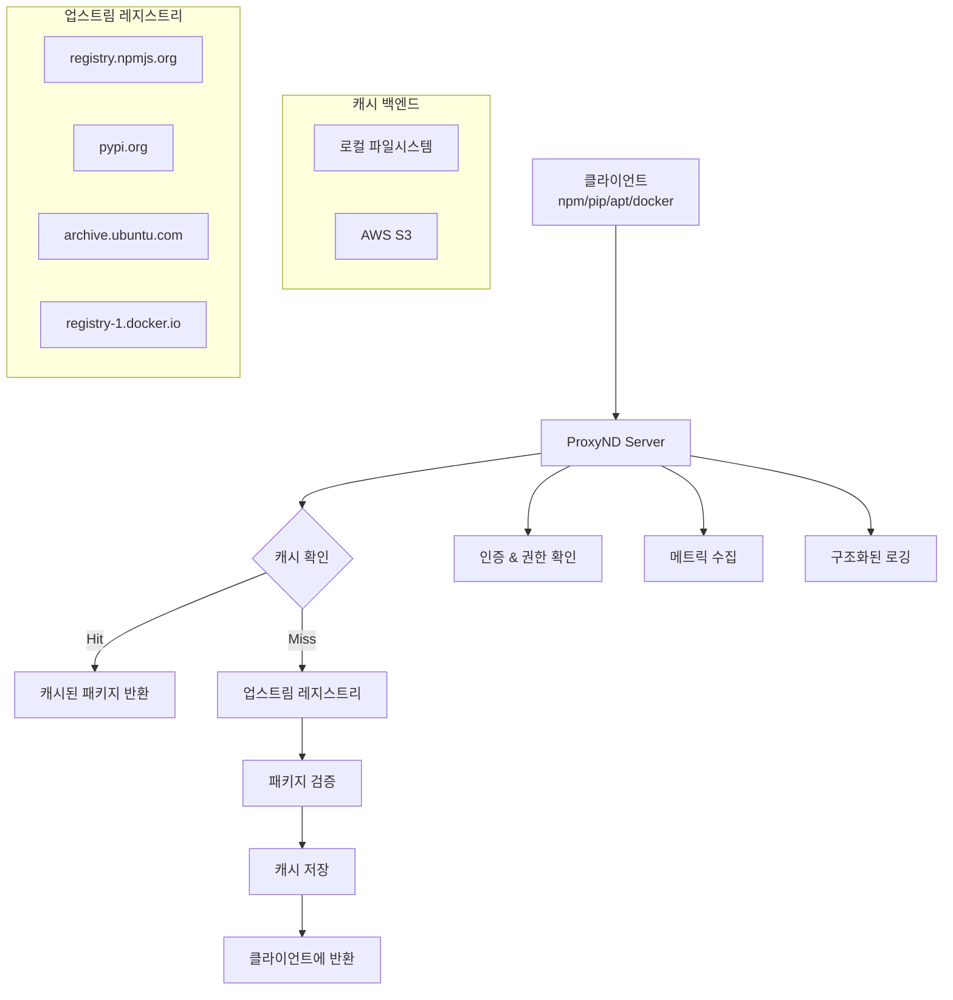

# 📦 ProxyND - Multi-format Package Registry Proxy Server

[](https://golang.org/)
[](https://hub.docker.com/r/scriptonbasestar/proxynd)
[](LICENSE)
[](https://github.com/scriptonbasestar/proxynd/actions)

**ProxyND**는 엔터프라이즈 환경을 위한 경량화된 다중 포맷 패키지 레지스트리 프록시 서버입니다. NPM, PyPI, APT, Docker Registry 등 다양한 패키지 매니저의 다운로드 속도 향상과 대역폭 절약을 제공하며, 기업 보안 정책을 준수하는 패키지 관리 솔루션입니다.

## ✨ 주요 특징

### 🚀 **다중 포맷 지원**
- **NPM** - Node.js 패키지 레지스트리 프록시
- **PyPI** - Python 패키지 인덱스 프록시  
- **APT** - Ubuntu/Debian 패키지 레지스트리 프록시
- **Docker Registry v2** - 컨테이너 이미지 레지스트리 프록시

### ⚡ **고성능 캐싱**
- **로컬 파일시스템** 캐시 백엔드
- **AWS S3** 호환 오브젝트 스토리지 지원
- **TTL 기반** 만료 정책 및 LRU 캐시 관리
- **대용량 파일** 스트리밍 지원

### 🔐 **엔터프라이즈 보안**
- **IP 화이트리스트** 및 CIDR 기반 접근 제어
- **Basic Authentication** 사용자 인증
- **사용자별 권한** 관리 (읽기/쓰기/삭제)
- **패키지 허용 목록** 기반 필터링

### 🛡️ **패키지 검증 및 보안**
- **SHA256 해시 검증** 패키지 무결성 확인
- **패키지 검증 실패** 시 자동 차단 및 알림
- **로그 및 웹훅** 기반 알림 시스템

### 📊 **운영 및 모니터링**
- **Prometheus 메트릭** `/metrics` 엔드포인트
- **구조화된 JSON 로깅** 시스템
- **헬스체크 API** `/healthz` 엔드포인트
- **실시간 모니터링** 대시보드

### 🐳 **클라우드 네이티브**
- **다중 아키텍처** Docker 이미지 (amd64, arm64)
- **Kubernetes Helm Chart** 제공
- **CI/CD 파이프라인** 통합
- **Systemd 서비스** 템플릿 제공

## 🏗️ 아키텍처



## 🚀 빠른 시작

### Docker로 실행

```bash
# 기본 실행
docker run -d \
  --name proxynd \
  -p 8080:8080 \
  -v ./config:/config \
  -v proxynd-storage:/storage \
  scriptonbasestar/proxynd:latest

# 서비스 확인
curl http://localhost:8080/healthz
```

### Docker Compose

```yaml
version: '3.8'
services:
  proxynd:
    image: scriptonbasestar/proxynd:latest
    ports:
      - "8080:8080"
    volumes:
      - ./sample-conf:/config:ro
      - proxynd-storage:/storage
    environment:
      - LOG_LEVEL=info
      - LOG_FORMAT=json
    restart: unless-stopped

volumes:
  proxynd-storage:
```

### Kubernetes (Helm)

```bash
# Helm 저장소 추가
helm repo add proxynd https://scriptonbasestar.github.io/proxynd
helm repo update

# ProxyND 설치
helm install proxynd proxynd/proxynd \
  --namespace proxynd \
  --create-namespace

# 상태 확인
kubectl get pods -n proxynd
```

## ⚙️ 설치 방법

### 1. 바이너리 설치

```bash
# 최신 릴리스 다운로드
curl -L https://github.com/scriptonbasestar/proxynd/releases/latest/download/proxynd-linux-amd64 -o proxynd
chmod +x proxynd

# 실행
./proxynd
```

### 2. 소스 빌드

```bash
# 저장소 클론
git clone https://github.com/scriptonbasestar/proxynd.git
cd proxynd

# 의존성 설치
go mod download

# 빌드
go build -o proxynd main.go

# 실행
./proxynd
```

### 3. Systemd 서비스

```bash
# 자동 설치 스크립트 사용
sudo ./systemd/install.sh -b ./proxynd -c ./sample-conf

# 서비스 시작
sudo systemctl start proxynd
sudo systemctl enable proxynd
```

## 🔧 설정

### 기본 설정 파일 구조

```yaml
# config/global.yaml
server:
  port: 8080
  host: "0.0.0.0"

logging:
  level: info
  format: json
  output: stdout

cache:
  type: filesystem  # filesystem 또는 s3
  ttl: 3600
  maxSize: 10737418240  # 10GB

# NPM 프록시 설정
npm:
  enabled: true
  upstream: https://registry.npmjs.org
  allowedPackages: ["*"]

# PyPI 프록시 설정
pip:
  enabled: true
  upstream: https://pypi.org/simple
  allowedPackages: ["*"]

# APT 프록시 설정
apt:
  enabled: true
  distributions:
    - name: ubuntu
      upstream: http://archive.ubuntu.com/ubuntu
      components: ["main", "universe"]
      architectures: ["amd64", "arm64"]

# Docker 프록시 설정
docker:
  enabled: true
  upstream: https://registry-1.docker.io
```

### 인증 설정

```yaml
# config/users.yaml
auth:
  enabled: true
  type: basic
  users:
    - username: admin
      password: changeme
      permissions: ["read", "write", "delete"]
    - username: readonly
      password: readonly
      permissions: ["read"]

ipFilter:
  enabled: true
  allowedNetworks:
    - "192.168.0.0/16"
    - "10.0.0.0/8"
    - "172.16.0.0/12"
```

### S3 캐시 백엔드 설정

```yaml
# config/cache-s3.yaml
cache:
  type: s3
  s3:
    bucket: proxynd-cache
    region: ap-northeast-2
    endpoint: ""  # S3 호환 스토리지용
    accessKeyId: ""  # 환경변수에서 설정 권장
    secretAccessKey: ""  # 환경변수에서 설정 권장
```

## 🖥️ CLI 도구 (proxyndctl)

ProxyND는 강력한 명령줄 도구 `proxyndctl`을 제공합니다:

### 주요 기능

- **캐시 관리**: 캐시 목록 조회, 삭제, 크기 확인
- **설정 검증**: 설정 파일 유효성 검사 및 조회
- **서버 상태**: 실시간 서버 상태 및 메트릭 조회
- **사용자 관리**: 사용자 추가/삭제/목록 조회
- **프록시 테스트**: 각 프록시 타입별 연결성 테스트

### 자동완성 설정

```bash
# Bash
source <(proxyndctl completion bash)

# Zsh
source <(proxyndctl completion zsh)

# Fish
proxyndctl completion fish > ~/.config/fish/completions/proxyndctl.fish
```

자세한 내용은 [CLI 자동완성 가이드](docs/CLI_COMPLETION.md)를 참조하세요.

## 🎯 사용 예제

### NPM 패키지 프록시

```bash
# npm 레지스트리 설정
npm config set registry http://localhost:8080/proxy/npm/

# 패키지 설치
npm install express

# 원래 레지스트리로 복원
npm config delete registry
```

### PyPI 패키지 프록시

```bash
# pip 인덱스 설정
pip install -i http://localhost:8080/proxy/pip/simple/ requests

# pip.conf 파일 설정 (영구적)
echo "[global]
index-url = http://localhost:8080/proxy/pip/simple/
trusted-host = localhost" > ~/.pip/pip.conf
```

### APT 패키지 프록시

```bash
# sources.list 백업
sudo cp /etc/apt/sources.list /etc/apt/sources.list.backup

# ProxyND를 APT 미러로 설정
echo "deb http://localhost:8080/proxy/apt/ubuntu/ jammy main universe" | sudo tee /etc/apt/sources.list

# 패키지 목록 업데이트
sudo apt update
```

### Docker Registry 프록시

```bash
# Docker 데몬 설정 (/etc/docker/daemon.json)
{
  "registry-mirrors": ["http://localhost:8080/proxy/docker/v2/"]
}

# Docker 서비스 재시작
sudo systemctl restart docker

# 이미지 pull
docker pull nginx:latest
```

## 📊 모니터링

### Prometheus 메트릭

```bash
# 메트릭 확인
curl http://localhost:8080/metrics

# 주요 메트릭
# - proxynd_requests_total{proxy_type="npm",status="200"}
# - proxynd_cache_hits_total{backend="filesystem"}
# - proxynd_cache_size_bytes{backend="filesystem"}
# - proxynd_request_duration_seconds
```

### 로그 분석

```bash
# 구조화된 JSON 로그
tail -f /var/log/proxynd/proxynd.log | jq '.'

# 특정 프록시 타입 필터링
tail -f /var/log/proxynd/proxynd.log | jq 'select(.proxy_type == "npm")'

# 에러 로그만 보기
tail -f /var/log/proxynd/proxynd.log | jq 'select(.level == "error")'
```

## 🔧 운영 관리

### 헬스체크

```bash
# 기본 헬스체크
curl http://localhost:8080/healthz

# 상세 헬스체크
curl http://localhost:8080/health/ready
curl http://localhost:8080/health/live
```

### 캐시 관리

```bash
# 캐시 통계 확인
curl http://localhost:8080/metrics | grep proxynd_cache

# 캐시 정리 (설정에 따라 자동 실행)
# TTL 기반 만료 및 LRU 정책으로 자동 관리
```

### 설정 리로드

```bash
# SIGHUP 시그널로 설정 리로드
sudo systemctl reload proxynd

# 또는 직접 시그널 전송
sudo kill -HUP $(pgrep proxynd)
```

## 🛡️ 보안

### 패키지 검증

ProxyND는 다운로드된 패키지의 무결성을 자동으로 검증합니다:

- **SHA256 해시 검증** - 업스트림 메타데이터와 비교
- **패키지 크기 검증** - 예상 크기와 실제 크기 비교
- **검증 실패 시 차단** - 손상된 패키지 자동 차단

### 접근 제어

```yaml
# 패키지별 접근 제어
npm:
  allowedPackages:
    - "express"
    - "lodash"
    - "@types/*"  # 와일드카드 지원
  blockedPackages:
    - "malicious-package"

# 사용자별 권한
users:
  - username: developer
    permissions: ["read"]
    allowedProxies: ["npm", "pip"]
  - username: admin
    permissions: ["read", "write", "delete"]
    allowedProxies: ["*"]
```

## 📈 성능 최적화

### 캐시 전략

```yaml
cache:
  type: filesystem
  maxSize: 21474836480  # 20GB
  ttl: 7200  # 2시간
  
  # LRU 정책 설정
  lru:
    maxEntries: 10000
    cleanupInterval: 300  # 5분마다 정리
```

### 동시 접속 처리

```yaml
server:
  maxConnections: 1000
  readTimeout: 30s
  writeTimeout: 30s
  idleTimeout: 60s
```

## 🧪 개발

### 로컬 개발 환경

```bash
# 개발 의존성 설치
make dev-prepare

# 설정 파일 준비
make dev-setup

# 개발 서버 실행
make dev-run

# 테스트 실행
make dev-test
```

### 테스트

```bash
# 단위 테스트
go test -v ./...

# 통합 테스트
cd tests/integration && make test

# E2E 테스트
cd tests/e2e && make test

# 커버리지 확인
go test -cover -coverprofile=coverage.out ./...
go tool cover -html=coverage.out
```

### 코드 품질

```bash
# 린트 실행
golangci-lint run

# 포맷 확인
gofmt -l .

# 로컬 CI 테스트
./scripts/ci-local-test.sh
```

## 📚 문서

- [배포 가이드](docs/DEPLOYMENT.md) - 다양한 환경에서의 배포 방법
- [CI/CD 가이드](docs/CI_CD.md) - 지속적 통합 및 배포 설정
- [로깅 가이드](docs/LOGGING.md) - 구조화된 로깅 시스템
- [메트릭 가이드](docs/METRICS.md) - Prometheus 메트릭 활용
- [헬스체크 가이드](docs/HEALTH_CHECK.md) - 헬스체크 시스템
- [멀티아키텍처 빌드](docs/MULTIARCH.md) - Docker 멀티아키텍처 빌드
- [패키지 검증](docs/PACKAGE_VERIFICATION.md) - 패키지 검증 시스템

## 🤝 기여하기

프로젝트에 기여하고 싶으시다면:

1. Fork the repository
2. Create a feature branch (`git checkout -b feature/amazing-feature`)
3. Commit your changes (`git commit -m 'Add amazing feature'`)
4. Push to the branch (`git push origin feature/amazing-feature`)
5. Open a Pull Request

### 개발 가이드라인

- 코드는 `gofmt`와 `golangci-lint`를 통과해야 합니다
- 모든 새로운 기능에는 테스트가 포함되어야 합니다
- 커밋 메시지는 [Conventional Commits](https://www.conventionalcommits.org/) 형식을 따릅니다

## 📄 라이선스

이 프로젝트는 [MIT 라이선스](LICENSE) 하에 배포됩니다.

## 🙏 감사의 말

ProxyND는 다음 프로젝트들로부터 영감을 받았습니다:

- [JFrog Artifactory](https://jfrog.com/artifactory/)
- [Sonatype Nexus](https://www.sonatype.com/nexus-repository-oss)
- [Verdaccio](https://verdaccio.org/)

## 📞 지원 및 문의

- **이슈 신고**: [GitHub Issues](https://github.com/scriptonbasestar/proxynd/issues)
- **기능 요청**: [GitHub Discussions](https://github.com/scriptonbasestar/proxynd/discussions)
- **이메일**: contact@scriptonbasestar.com

---

<div align="center">

**⭐ 이 프로젝트가 유용하다면 스타를 눌러주세요! ⭐**

Made with ❤️ by [ScriptonBasestar](https://github.com/scriptonbasestar)

</div>