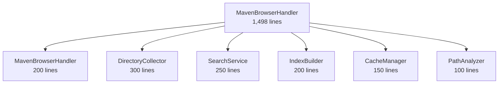

# 🔄 ProxyND 업데이트된 리팩토링 가이드

> **작성일**: 2025-07-24  
> **기반**: 기존 COMPREHENSIVE_REFACTORING_PLAN.md 및 IMMEDIATE_CLEANUP_GUIDE.md 분석  
> **상태**: 프로젝트 변경사항 반영 완료

## 📋 문서 개요

이 문서는 ProxyND 프로젝트의 기존 리팩토링 계획을 현재 프로젝트 상태에 맞춰 업데이트한 새로운 리팩토링 가이드입니다.

### 🔄 주요 변경사항

#### 기존 계획 대비 진행된 사항
- ✅ **Makefile 모듈화**: 8개 파일로 체계화 완료
- ✅ **개발 환경 표준화**: Air, 통합 헬프 시스템 도입
- ✅ **Clean Architecture 기반**: `internal/` 구조 정착
- ✅ **설정 관리 중앙화**: Viper 기반 통합 설정 서비스
- ✅ **인터페이스 기반 설계**: Mock 지원, 의존성 주입

#### 새로 발견된 문제점
- ⚠️ **핸들러 거대화**: Maven 브라우저 핸들러 1,498라인
- ⚠️ **테스트 코드 중복**: 유사 패턴 반복
- ⚠️ **검색 기능 분산**: 여러 곳에 로직 흩어짐

## 🎯 업데이트된 리팩토링 전략

### Phase 1: 핸들러 분해 (최우선)

**목표**: 거대한 핸들러를 관리 가능한 컴포넌트로 분해

#### 1.1 Maven 브라우저 핸들러 분해 (7일)



**일별 계획**:

**Day 1**: 아키텍처 설계
```go
// internal/domain/maven/interfaces.go
type DirectoryCollector interface {
    CollectDirectory(ctx context.Context, path string) (*DirectoryData, error)
    CollectFromMirror(ctx context.Context, mirror MirrorConfig, path string) ([]Entry, error)
}

type SearchService interface {
    Search(ctx context.Context, query string) (*SearchResult, error)
    IndexArtifacts(ctx context.Context) error
    GetIndexStats(ctx context.Context) (*IndexStats, error)
}
```

**Day 2**: DirectoryCollector 분해
- 추출 대상: `collectDirectoryData`, `fetchDirectoryFromMirror` 메서드들
- 새 파일: `internal/services/maven/directory_collector.go` (300라인)

**Day 3**: SearchService 분해  
- 추출 대상: `performGlobalSearch`, `buildSearchIndex` 메서드들
- 새 파일: `internal/services/maven/search_service.go` (250라인)

**Day 4**: CacheManager 분해
- 추출 대상: `preloadPopularPaths`, 캐시 관리 로직
- 새 파일: `internal/services/maven/cache_manager.go` (150라인)

**Day 5**: PathAnalyzer 분해
- 추출 대상: `parseMavenPath`, `isVersionLike` 함수들
- 새 파일: `internal/services/maven/path_analyzer.go` (100라인)

**Day 6**: 새로운 MavenBrowserHandler 구성
```go
// 새로운 구조 (200라인으로 축소)
type MavenBrowserHandler struct {
    directoryCollector *maven.DirectoryCollector
    searchService     *maven.SearchService
    cacheManager      *maven.CacheManager
    pathAnalyzer      *maven.PathAnalyzer
    logger            logging.Logger
}

func (h *MavenBrowserHandler) Handle(c *fiber.Ctx) error {
    pathInfo, err := h.pathAnalyzer.ParsePath(c.Params("*"))
    if err != nil {
        return err
    }

    if cached, found := h.cacheManager.Get(ctx, pathInfo.Path); found {
        return c.JSON(cached)
    }

    data, err := h.directoryCollector.CollectDirectory(ctx, pathInfo.Path)
    if err != nil {
        return err
    }

    if searchQuery := c.Query("search"); searchQuery != "" {
        return h.searchService.Search(ctx, searchQuery)
    }

    return c.JSON(data)
}
```

**Day 7**: 통합 테스트 및 성능 검증

#### 1.2 APT/NPM 핸들러 분해 (5일)

APT와 NPM 핸들러도 동일한 패턴으로 분해:
- APT: 800라인 → 3×200라인
- NPM: 400라인 → 2×200라인

### Phase 2: 도메인 서비스 구축 (2주)

#### 2.1 통합 검색 시스템 (1주)
```go
// internal/services/search/unified_search.go
type UnifiedSearchService struct {
    indexers map[string]SearchIndexer
    storage  SearchStorage
    logger   logging.Logger
}

func (s *UnifiedSearchService) Search(ctx context.Context, req *SearchRequest) (*SearchResponse, error)
func (s *UnifiedSearchService) IndexAll(ctx context.Context) error
func (s *UnifiedSearchService) GetStats(ctx context.Context) (*SearchStats, error)
```

#### 2.2 캐시 시스템 고도화 (1주)
```go
// internal/services/cache/multi_tier_cache.go
type MultiTierCache struct {
    l1Cache *memory.Cache
    l2Cache *file.Cache
    l3Cache *s3.Cache
    policy  *EvictionPolicy
}

func (c *MultiTierCache) Get(ctx context.Context, key string) (*CacheEntry, error)
func (c *MultiTierCache) Set(ctx context.Context, key string, data []byte, ttl time.Duration) error
```

### Phase 3: 이벤트 기반 아키텍처 (2주)

#### 3.1 도메인 이벤트 시스템
```go
// internal/events/domain_events.go
type ArtifactDownloaded struct {
    ProxyType   string
    ArtifactID  string
    UserAgent   string
    Timestamp   time.Time
    Size        int64
}

type EventBus interface {
    Publish(ctx context.Context, event DomainEvent) error
    Subscribe(eventType string, handler EventHandler) error
}

// 이벤트 처리 예시
searchIndexer.Handle(&ArtifactDownloaded{...}) // 검색 인덱스 업데이트
metricsCollector.Handle(&ArtifactDownloaded{...}) // 메트릭 수집
cacheWarmer.Handle(&ArtifactDownloaded{...}) // 관련 아티팩트 사전 캐싱
```

#### 3.2 비동기 처리 최적화
- 워커 풀 패턴 도입
- 큐 기반 작업 처리
- 백프레셔 제어

## 📊 성공 지표

### 1. 코드 품질 지표
- [ ] 핸들러 평균 크기: 200라인 이하
- [ ] 함수 복잡도: 10 이하
- [ ] 코드 중복률: 5% 이하
- [ ] 테스트 커버리지: 85% 이상

### 2. 성능 지표
- [ ] Maven 브라우저 응답시간: < 500ms
- [ ] 검색 응답시간: < 100ms
- [ ] 메모리 사용량: 15% 감소
- [ ] 캐시 히트율: > 80%

### 3. 개발 생산성 지표
- [ ] 새 프록시 추가 시간: 4시간 이하
- [ ] 버그 수정 시간: 50% 단축
- [ ] 코드 리뷰 시간: 30% 감소

## 🛡️ 리스크 관리

### 1. 점진적 마이그레이션
```go
// Feature Flag 패턴
if config.Experimental.NewMavenBrowser {
    return newMavenBrowserHandler.Handle(c)
}
return legacyMavenBrowserHandler.Handle(c)
```

### 2. 롤백 전략
- 각 단계별 Git 태그 생성
- Feature Flag로 즉시 롤백 가능
- 성능 모니터링으로 자동 롤백

### 3. 성능 모니터링
```go
// Prometheus 메트릭
var (
    responseTime = prometheus.NewHistogramVec(
        prometheus.HistogramOpts{
            Name: "maven_browser_response_time_seconds",
            Help: "Maven browser response time",
        },
        []string{"handler", "path_type"},
    )
)
```

## 🔧 개발 패턴

### 1. Micro-Handler Pattern
```go
// 책임별 핸들러 분리
type HandlerGroup struct {
    proxy   *ProxyHandler
    browser *BrowserHandler
    search  *SearchHandler
    cache   *CacheHandler
}

func (g *HandlerGroup) Route(app *fiber.App) {
    group := app.Group("/proxy/maven")
    group.Get("/*", g.proxy.Handle)
    group.Get("/browse/*", g.browser.Handle)
    group.Get("/search", g.search.Handle)
}
```

### 2. Builder Pattern
```go
type GAVTreeBuilder struct {
    entries []DirectoryEntry
    filters []FilterFunc
    sorters []SortFunc
}

func NewGAVTreeBuilder() *GAVTreeBuilder {
    return &GAVTreeBuilder{}
}

func (b *GAVTreeBuilder) WithEntries(entries []DirectoryEntry) *GAVTreeBuilder {
    b.entries = entries
    return b
}

func (b *GAVTreeBuilder) Build() *GAVTree {
    // 복잡한 트리 구성 로직
}
```

### 3. Domain Event Pattern
```go
// 이벤트 발행
eventBus.Publish(ctx, &ArtifactDownloaded{...})

// 이벤트 처리
searchIndexer.Handle(event) // 검색 인덱스 업데이트
metricsCollector.Handle(event) // 메트릭 수집
cacheWarmer.Handle(event) // 관련 아티팩트 사전 캐싱
```

## 📅 실행 일정

### Week 1-2: Maven 핸들러 분해
- Day 1-7: MavenBrowserHandler 분해
- Day 8-12: APT/NPM 핸들러 분해

### Week 3-4: 도메인 서비스 구축
- Week 3: 통합 검색 시스템
- Week 4: 캐시 시스템 고도화

### Week 5-6: 이벤트 기반 아키텍처
- Week 5: 이벤트 시스템 구축
- Week 6: 비동기 처리 최적화

### Week 7: 품질 향상
- 테스트 커버리지 85% 달성
- API 문서 자동 생성
- 성능 벤치마크 개선

## 🚀 즉시 실행 (이번 주)

### Day 1-2: Maven 핸들러 분석
1. `maven_browser_handler.go` (1,498라인) 상세 분석
2. 분해 지점 식별 및 인터페이스 설계
3. 의존성 그래프 작성

### Day 3-5: 첫 번째 분해 실행
1. `DirectoryCollector` 추출
2. 기존 테스트 유지하면서 점진적 분해
3. 성능 회귀 테스트

## 📚 관련 문서

- [기존 리팩토링 계획](COMPREHENSIVE_REFACTORING_PLAN.md)
- [즉시 정리 가이드](IMMEDIATE_CLEANUP_GUIDE.md)
- [프로젝트 로컬 가이드](CLAUDE.local.md)

## 📝 체크리스트

### 리팩토링 준비
- [ ] 기존 테스트 슈트 실행 확인
- [ ] 성능 베이스라인 측정
- [ ] Feature Flag 시스템 준비
- [ ] 롤백 절차 수립

### Phase 1 완료 기준
- [ ] MavenBrowserHandler < 200라인
- [ ] 모든 기존 테스트 통과
- [ ] 성능 회귀 없음 (±10% 이내)
- [ ] 새 컴포넌트 테스트 커버리지 > 80%

### Phase 2 완료 기준
- [ ] 통합 검색 시스템 구축
- [ ] 다층 캐시 시스템 구축
- [ ] 전체 시스템 통합 테스트 통과

### Phase 3 완료 기준
- [ ] 이벤트 기반 아키텍처 완성
- [ ] 전체 테스트 커버리지 85% 달성
- [ ] 성능 목표 달성

---

**다음 단계**: Maven 핸들러 분해부터 시작하여 점진적으로 전체 시스템을 개선해나갑니다.

> 이 문서는 살아있는 문서입니다. 진행 상황에 따라 지속적으로 업데이트됩니다.
