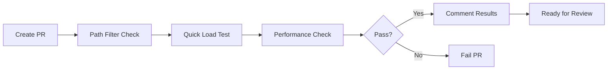
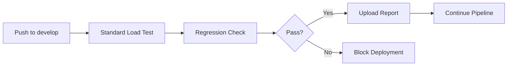

# CI/CD Integration for Enterprise API Load Testing

Automated load testing integration for Enterprise API using GitHub Actions.

## Overview

The Enterprise API load testing is fully integrated into the CI/CD pipeline with automatic performance regression detection.

## Workflows

### Enterprise API Load Test

**File:** `.github/workflows/enterprise-load-test.yml`

**Triggers:**

1. **Pull Requests** → Quick load test (10s, 10 concurrent users)
2. **Push to develop/master** → Standard load test (60s, 100 concurrent users)
3. **Manual dispatch** → Custom scenario selection

**Path Filters:**
- `internal/adapters/http/fiber/handlers/enterprise/**`
- `internal/adapters/http/fiber/routers/enterprise_router.go`
- `internal/adapters/http/fiber/middleware/enterprise/**`
- `scripts/loadtest/**`

## Jobs

### 1. Quick Load Test (PR Only)

**Purpose:** Fast validation for pull requests
**Duration:** ~5 minutes
**Scenario:** Quick (10s, 10 concurrent users)

**Steps:**
1. Checkout code
2. Setup Go environment
3. Build ProxyND
4. Start server
5. Run quick load test
6. Check performance thresholds
7. Comment results on PR
8. Upload artifacts

**Performance Thresholds:**
- P95 Latency: < 500ms
- Throughput: > 50 rps
- Error Rate: < 1%

**Example PR Comment:**
```markdown
## 🚀 Enterprise API Quick Load Test

**Scenario:** Quick validation (10s, 10 concurrent users)
**Triggered by:** PR #123

### 📊 Results Summary

Testing: Analytics Overview...
✓ Total requests: 543, Cache hit rate: 87.5%

All tests completed!
```

### 2. Standard Load Test (develop/master)

**Purpose:** Comprehensive performance validation
**Duration:** ~10 minutes
**Scenario:** Standard (60s, 100 concurrent users)

**Steps:**
1. Checkout code
2. Setup Go environment
3. Build ProxyND
4. Start server
5. Run standard load test
6. Check performance regression
7. Upload performance report
8. Fail build on regression

**Performance Thresholds:**
- P95 Latency: < 1000ms
- Throughput: > 100 rps
- Error Rate: < 5%

**Artifacts:**
- `load_test_output.txt`: Full test output
- `load_test_results.md`: Formatted results
- `performance_report.md`: Complete report
- `regression_check.md`: Regression analysis

**Retention:** 90 days

### 3. Collect Prometheus Metrics

**Purpose:** Provide metrics context for PRs
**Duration:** ~1 minute
**Runs after:** Quick load test

**Output:**
- Comment with metrics summary
- Links to Prometheus/Grafana

## Manual Workflow Dispatch

### Trigger Manual Test

**GitHub UI:**
1. Go to **Actions** tab
2. Select **Enterprise API Load Test**
3. Click **Run workflow**
4. Choose scenario and endpoints
5. Click **Run**

**GitHub CLI:**
```bash
# Standard test
gh workflow run enterprise-load-test.yml

# Custom scenario
gh workflow run enterprise-load-test.yml \
  -f scenario=stress \
  -f endpoints=all

# Specific endpoints
gh workflow run enterprise-load-test.yml \
  -f scenario=standard \
  -f endpoints="rbac,audit,analytics"
```

### Available Scenarios

| Scenario | Duration | Concurrency | Use Case |
|----------|----------|-------------|----------|
| `quick` | 10s | 10 users | PR validation |
| `standard` | 60s | 100 users | Regular testing |
| `stress` | 60s | 500 users | Stress testing |
| `ramp-up` | 120s | 10→1000 users | Auto-scaling |
| `sustained` | 300s | 100 users | Stability |

## Performance Regression Detection

### How It Works

1. **Run load test** with defined scenario
2. **Extract metrics** from test output
3. **Compare against thresholds**
4. **Fail build** if thresholds exceeded
5. **Upload report** for analysis

### Regression Thresholds

**Quick Test (PR):**
```bash
MAX_P95_LATENCY=500    # ms
MIN_THROUGHPUT=50      # rps
MAX_ERROR_RATE=1       # percent
```

**Standard Test (develop/master):**
```bash
MAX_P95_LATENCY=1000   # ms
MIN_THROUGHPUT=100     # rps
MAX_ERROR_RATE=5       # percent
```

### Regression Report Format

```markdown
## 🎯 Performance Regression Check

**Thresholds:**
- P95 Latency: < 1000ms
- Throughput: > 100 rps
- Error Rate: < 5%

**Status:** ✅ PASSED
```

## Integration with Existing Workflows

### Workflow Hierarchy

```
CI Pipeline
├── ci.yml (main CI)
├── testing.yml (unit/integration tests)
├── performance.yml (Go benchmarks)
└── enterprise-load-test.yml (API load testing) ← NEW
```

### Non-Conflicting Design

- **Different triggers**: Path filters prevent unnecessary runs
- **Separate artifacts**: Different retention policies
- **Complementary**: performance.yml for benchmarks, enterprise-load-test.yml for HTTP load
- **Independent**: Can run in parallel

## Artifacts

### Quick Load Test Results

**Name:** `quick-load-test-results`
**Retention:** 30 days
**Contents:**
- `load_test_output.txt`: Raw output
- `load_test_results.md`: Formatted results

### Standard Load Test Results

**Name:** `standard-load-test-results-{commit-sha}`
**Retention:** 90 days
**Contents:**
- `load_test_output.txt`: Raw output
- `load_test_results.md`: Formatted results
- `performance_report.md`: Complete report
- `regression_check.md`: Regression analysis

### Download Artifacts

**GitHub UI:**
1. Go to **Actions** tab
2. Click on workflow run
3. Scroll to **Artifacts** section
4. Click artifact name to download

**GitHub CLI:**
```bash
# List artifacts
gh run list --workflow=enterprise-load-test.yml

# Download latest
gh run download --name quick-load-test-results
```

## Monitoring During CI/CD

### View Real-Time Logs

```bash
# Follow workflow run
gh run watch

# View specific job
gh run view --job=quick-load-test --log
```

### Check Metrics Endpoint

Add to workflow (for debugging):
```yaml
- name: Check metrics
  run: |
    curl -s http://localhost:8080/metrics | grep enterprise_api
```

## Troubleshooting

### Workflow Not Triggering

**Check path filters:**
```bash
# Modified files in PR
git diff --name-only origin/develop...HEAD
```

**Verify paths match:**
- `internal/adapters/http/fiber/handlers/enterprise/**`
- `internal/adapters/http/fiber/routers/enterprise_router.go`

### Load Test Failing

**Common issues:**
1. **Server not starting**: Check build logs
2. **Health check timeout**: Server may be slow to start
3. **Connection refused**: Port 8080 may be in use

**Debug steps:**
```yaml
- name: Debug server
  run: |
    ps aux | grep proxynd
    curl -v http://localhost:8080/health
    cat logs/proxynd.log
```

### Performance Regression False Positive

**Adjust thresholds** in workflow:
```yaml
- name: Check performance regression
  run: |
    MAX_P95_LATENCY=1500  # Increase if needed
    MIN_THROUGHPUT=75     # Decrease if needed
```

### Artifacts Not Uploading

**Check retention:**
```yaml
retention-days: 30  # Increase if needed
```

**Verify paths exist:**
```yaml
- name: List files
  run: ls -la load_test_*.txt
```

## Best Practices

### 1. Run Locally First

Test workflow locally before pushing:
```bash
# Install act (GitHub Actions local runner)
brew install act  # macOS
# or
curl https://raw.githubusercontent.com/nektos/act/master/install.sh | sudo bash

# Run workflow locally
act pull_request -W .github/workflows/enterprise-load-test.yml
```

### 2. Incremental Rollout

Start with:
1. **Week 1**: Manual dispatch only (observe results)
2. **Week 2**: Enable PR quick tests (monitor)
3. **Week 3**: Enable push tests (full integration)

### 3. Monitor Resource Usage

**GitHub Actions minutes:**
- Free tier: 2,000 min/month
- Quick test: ~5 min
- Standard test: ~10 min

**Optimize:**
- Use path filters (avoid unnecessary runs)
- Cache Go modules
- Parallel jobs where possible

### 4. Update Thresholds Regularly

Review thresholds quarterly:
```bash
# Analyze historical data
gh run list --workflow=enterprise-load-test.yml --json conclusion

# Update thresholds based on trends
```

## Integration Examples

### Example 1: PR Workflow



### Example 2: Deploy Workflow



## Metrics Integration

### View Metrics in Grafana

After workflow run:
1. Import dashboard: `deployments/grafana/enterprise-api-dashboard.json`
2. Set Prometheus datasource
3. View load test metrics

### Prometheus Queries

```promql
# Request rate during load test
sum(rate(proxynd_enterprise_api_requests_total[5m]))

# P95 latency
histogram_quantile(0.95,
  rate(proxynd_enterprise_api_request_duration_seconds_bucket[5m]))

# Error rate
sum(rate(proxynd_enterprise_api_errors_total[5m])) /
sum(rate(proxynd_enterprise_api_requests_total[5m])) * 100
```

## Future Enhancements

### Planned Features

1. **Performance Comparison**
   - Compare with baseline from main branch
   - Show regression/improvement percentages

2. **Custom Scenarios**
   - Define scenarios in YAML
   - Test specific endpoint combinations

3. **Load Test Matrix**
   - Test multiple scenarios in parallel
   - Generate comparison report

4. **Historical Trends**
   - Store metrics in database
   - Generate trend charts

5. **Auto-Scaling Verification**
   - Test Kubernetes HPA triggers
   - Validate resource limits

## Further Reading

- [Load Testing Guide](../../scripts/loadtest/README.md)
- [Prometheus Metrics](../../docs/api/METRICS.md)
- [Grafana Dashboard](../../deployments/grafana/README.md)
- [GitHub Actions Documentation](https://docs.github.com/en/actions)

## Support

For questions or issues:
- GitHub Issues: https://github.com/ScriptonBasestar/proxynd/issues
- GitHub Actions: https://docs.github.com/en/actions/learn-github-actions
- Email: support@proxynd.io
