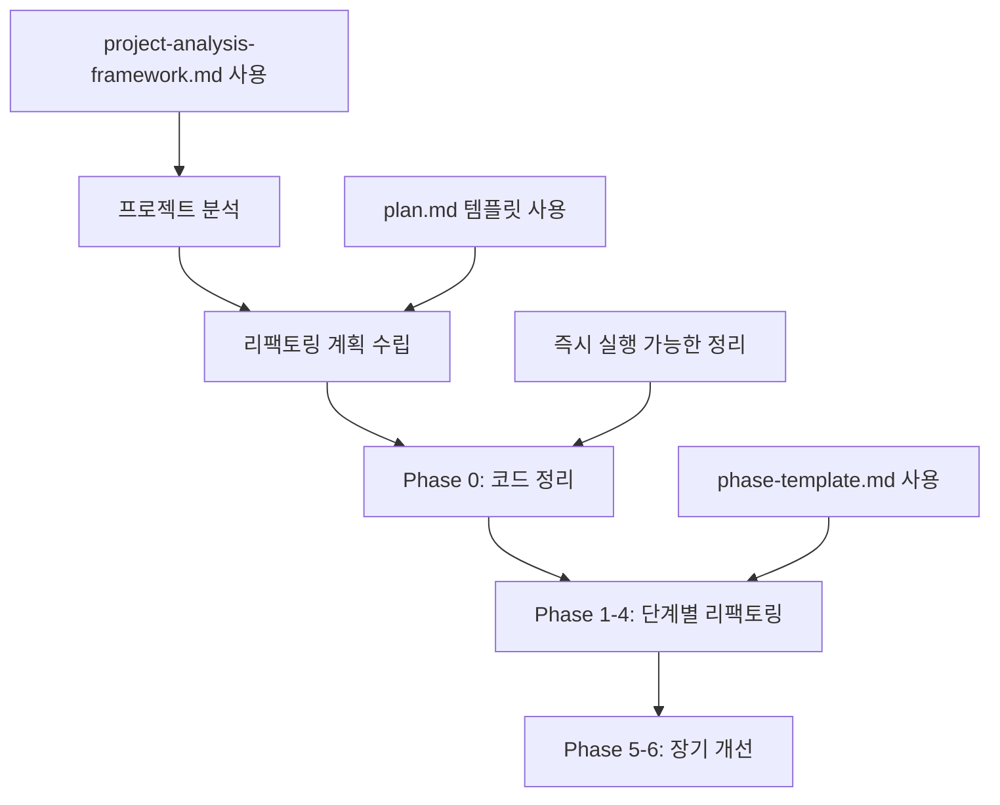

# 리팩토링 프롬프트 사용 가이드

## 🚀 시작하기

이 가이드는 AI를 활용한 체계적인 리팩토링을 수행하는 방법을 설명합니다.

## 📋 전체 프로세스 개요



## 🔍 Step 1: 프로젝트 분석

### 1.1 분석 프레임워크 활용
```bash
# 1. project-analysis-framework.md 참고
# 2. 프로젝트 기본 정보 수집
find . -name "*.{ext}" | wc -l  # 파일 수
cloc .  # 코드 라인 수

# 3. 정적 분석 도구 실행
# 언어별 도구 사용 (예: golangci-lint, eslint, pylint)
```

### 1.2 AI 프롬프트 예시
```markdown
다음 프로젝트를 분석해주세요:
- 프로젝트 타입: [Web API/Library/CLI Tool/etc]
- 주 언어: [언어명]
- 프레임워크: [프레임워크명]

project-analysis-framework.md의 체크리스트에 따라:
1. 코드베이스 구조 분석
2. 주요 문제점 식별
3. 개선 우선순위 제안
```

## 📝 Step 2: 리팩토링 계획 수립

### 2.1 마스터 플랜 작성
```markdown
# phases/plan.md 템플릿을 프로젝트에 맞게 커스터마이징

project:
  name: "내 프로젝트"
  type: "Web API"
  language: "Python"
  framework: "FastAPI"
  size:
    files: 150
    lines: 25000
  
priorities:
  - "API 응답 시간 개선"
  - "테스트 커버리지 향상"
  - "코드 중복 제거"
```

### 2.2 Phase별 일정 조정
- **소규모 프로젝트**: Phase 통합 가능
- **중규모 프로젝트**: 표준 일정 적용
- **대규모 프로젝트**: 더 세분화된 단계

## 🧹 Step 3: Phase 0 - 코드 정리

### 3.1 즉시 실행 가능한 작업
```bash
# 코드 포맷팅 (언어별)
# Python
black . && isort .

# JavaScript/TypeScript  
prettier --write . && eslint --fix .

# Go
gofmt -w . && goimports -w .

# Java
mvn spotless:apply
```

### 3.2 자동화 스크립트 예시
```bash
#!/bin/bash
# cleanup.sh

echo "🧹 Starting Phase 0 cleanup..."

# 1. 포맷팅
echo "📐 Formatting code..."
[언어별 포맷터 명령]

# 2. 임시 파일 정리
echo "🗑️  Removing temporary files..."
find . -name "*.tmp" -o -name "*.bak" -o -name "*~" | xargs rm -f

# 3. TODO 정리
echo "📝 Listing TODOs..."
grep -r "TODO\|FIXME" --include="*.{ext}" . > todos.txt

echo "✅ Phase 0 cleanup complete!"
```

## 🔨 Step 4: Phase 1-4 실행

### 4.1 Phase별 프롬프트 활용

#### Phase 1.1: 의존성 주입 예시
```markdown
phase-template.md를 참고하여 의존성 주입 리팩토링 계획을 작성해주세요.

현재 상황:
- 설정 파일을 매번 읽는 패턴이 50군데 이상
- 테스트 시 의존성 모킹이 어려움
- 싱글톤 패턴 남용

목표:
- 중앙화된 의존성 관리
- 테스트 용이성 향상
- 명시적 의존성 표현
```

### 4.2 단계별 검증
```bash
# 각 Phase 완료 후 실행
make test        # 테스트
make lint        # 정적 분석  
make benchmark   # 성능 측정
```

## 🎯 프로젝트 타입별 가이드

### Web API 프로젝트
```markdown
주요 리팩토링 포인트:
1. 라우팅 구조 표준화
2. 미들웨어 체인 최적화
3. 에러 응답 포맷 통일
4. API 버저닝 전략

특별 고려사항:
- 하위 호환성 유지
- 응답 시간 모니터링
- API 문서 자동 생성
```

### Library 프로젝트
```markdown
주요 리팩토링 포인트:
1. 공개 API 최소화
2. 내부 구현 은닉
3. 확장 포인트 제공
4. 의존성 최소화

특별 고려사항:
- 시맨틱 버저닝
- 마이그레이션 가이드
- 예제 코드 유지
```

### CLI Tool 프로젝트
```markdown
주요 리팩토링 포인트:
1. 명령어 구조 개선
2. 플래그/옵션 표준화
3. 출력 포맷 일관성
4. 에러 메시지 개선

특별 고려사항:
- 스크립트 호환성
- 파이프라인 지원
- 자동완성 지원
```

### Microservice 프로젝트
```markdown
주요 리팩토링 포인트:
1. 서비스 경계 재정의
2. 통신 패턴 표준화
3. 데이터 일관성 보장
4. 복원력 패턴 적용

특별 고려사항:
- 무중단 배포
- 분산 추적
- 서킷 브레이커
```

## 💡 실용적인 팁

### 1. AI 컨텍스트 관리
```markdown
# 좋은 예: 구체적이고 범위가 명확
"handlers/ 디렉토리의 중복 에러 처리 패턴을 분석하고 
BaseHandler를 만들어 통합하는 계획을 작성해주세요."

# 나쁜 예: 너무 광범위
"전체 프로젝트를 리팩토링해주세요."
```

### 2. 점진적 접근
```markdown
# 리팩토링 커밋 메시지 컨벤션
refactor(phase1.1): extract config manager
refactor(phase1.1): introduce dependency injection
refactor(phase1.2): standardize error handling

# 각 커밋은 독립적으로 빌드/테스트 가능해야 함
```

### 3. 팀 협업
```markdown
# 리팩토링 PR 템플릿
## 변경 사항
- Phase X.Y 구현
- 주요 변경: ...

## 테스트
- [ ] 기존 테스트 통과
- [ ] 새 테스트 추가
- [ ] 성능 테스트 통과

## 영향 범위
- 직접 영향: ...
- 간접 영향: ...

## 롤백 계획
...
```

## 📊 성과 측정

### 메트릭 추적 템플릿
```markdown
| Phase | 시작일 | 완료일 | 주요 지표 | 개선율 |
|-------|--------|--------|-----------|---------|
| 0 | - | - | 정적 분석 경고 | -70% |
| 1.1 | - | - | 중복 초기화 코드 | -80% |
| 1.2 | - | - | 에러 처리 일관성 | +90% |
| 2.1 | - | - | 코드 중복률 | -30% |
| 2.2 | - | - | 테스트 커버리지 | +25% |
```

### 품질 대시보드
```bash
# 자동화된 품질 리포트 생성
#!/bin/bash

echo "📊 Quality Report - $(date)"
echo "========================"
echo ""
echo "📏 Code Metrics:"
cloc . --json | jq '.SUM'
echo ""
echo "🧪 Test Coverage:"
[테스트 커버리지 명령]
echo ""
echo "⚡ Performance:"
[성능 측정 명령]
echo ""
echo "🔍 Static Analysis:"
[정적 분석 결과]
```

## 🚨 일반적인 함정과 해결책

### 1. 과도한 리팩토링
**문제**: 필요 이상으로 코드를 복잡하게 만듦
**해결**: YAGNI 원칙 적용, 실제 필요가 생길 때까지 기다림

### 2. 테스트 없는 리팩토링
**문제**: 기능이 깨져도 모름
**해결**: 리팩토링 전 테스트 작성, 각 단계마다 검증

### 3. 한 번에 너무 많은 변경
**문제**: 문제 발생 시 원인 찾기 어려움
**해결**: 작은 단위로 나누어 진행, 각각 커밋

### 4. 팀과의 소통 부족
**문제**: 다른 개발자의 작업과 충돌
**해결**: 리팩토링 계획 공유, 정기적인 동기화

## 📚 추가 리소스

### 도구 모음
- **정적 분석**: SonarQube, CodeClimate
- **리팩토링 도구**: IDE 기능 활용
- **성능 분석**: 언어별 프로파일러
- **시각화**: CodeScene, Gource

### 참고 도서
- "Refactoring" by Martin Fowler
- "Clean Code" by Robert C. Martin
- "Working Effectively with Legacy Code" by Michael Feathers

### 온라인 리소스
- [Refactoring.guru](https://refactoring.guru)
- [Source Making](https://sourcemaking.com)
- 언어별 스타일 가이드

## 🎯 체크리스트

### 시작 전
- [ ] 프로젝트 분석 완료
- [ ] 리팩토링 계획 수립
- [ ] 팀 동의 확보
- [ ] 백업 및 브랜치 생성

### 진행 중
- [ ] Phase 0 정리 완료
- [ ] 각 Phase별 목표 달성
- [ ] 지속적인 테스트 실행
- [ ] 정기적인 진행 상황 공유

### 완료 후
- [ ] 전체 테스트 통과
- [ ] 성능 목표 달성
- [ ] 문서 업데이트
- [ ] 회고 및 학습 공유

이 가이드를 따라 체계적이고 안전한 리팩토링을 수행하세요! 🚀